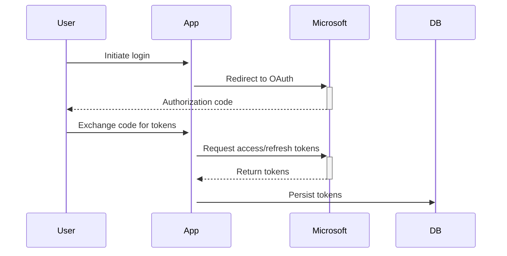

# Authentication Module

## Purpose
Handles OAuth 2.0 authentication flow and token management for Microsoft Graph API.

## Key Functions
- `configureAuthRoutes(app)` - Sets up authentication routes (/login, /logout, /auth/callback).
- `refreshTokenIfAboutToExpire(accessToken, refreshToken)` - Automatically renews access tokens if they are about to expire.
- Token persistence via `persistAccessToken(accessToken)` and `persistRefreshToken(refreshToken)`.

## Authentication Routes Details

### /login
Redirects the user to the Microsoft login page to initiate the OAuth 2.0 flow.

**Parameters:**

The request includes the following parameters:

- `client_id`: The application's client ID.
- `response_type`:  Set to `code` to indicate that the authorization code flow is being used.
- `redirect_uri`: The URI to which Microsoft will redirect the user after authorization.
- `response_mode`: Set to `query`.
- `scope`: Specifies the permissions the application is requesting (`offline_access https://graph.microsoft.com/Chat.Read`).

### /logout
Revokes the access token (if available) and redirects the user to the /login route.

### /auth/callback
Handles the OAuth 2.0 callback from Microsoft. It exchanges the authorization code for access and refresh tokens.

**Token Exchange:**

The route makes a POST request to the Microsoft token endpoint with the following parameters:

- `client_id`: The application's client ID.
- `client_secret`: The application's client secret.
- `grant_type`: Set to `authorization_code`.
- `code`: The authorization code received from Microsoft.
- `redirect_uri`: The URI to which Microsoft redirected the user.
- `scope`: Specifies the permissions the application is requesting (`https://graph.microsoft.com/Chat.Read`).

## Refresh Token Logic

The `refreshTokenIfAboutToExpire` function checks if the access token is about to expire. If it is, the function uses the refresh token to obtain a new access token.

**Token Expiration Check:**

The function decodes the access token (which is a JWT) to get the expiration time. It then compares the expiration time to the current time. If the token will expire in less than 30 minutes, the function proceeds to refresh the token.

**Refresh Request:**

The function makes a POST request to the Microsoft token endpoint with the following parameters:

- `client_id`: The application's client ID.
- `client_secret`: The application's client secret.
- `refresh_token`: The refresh token.
- `grant_type`: Set to `refresh_token`.
- `scope`: Specifies the permissions the application is requesting (`offline_access https://graph.microsoft.com/.default`).

**Code Example:**

```javascript
async function callGraphAPI(accessToken) {
  try {
    // Check if the token needs to be refreshed
    const { newAccessToken } = await refreshTokenIfAboutToExpire(accessToken, refreshToken);
    
    const actualAccessToken = newAccessToken || accessToken;

    // Use the access token to call the Microsoft Graph API
    const response = await axios.get('https://graph.microsoft.com/v1.0/me', {
      headers: {
        Authorization: `Bearer ${actualAccessToken}`
      }
    });
    console.log(response.data);
  } catch (error) {
    console.error('Error calling Graph API:', error);
  }
}
```

## Flow Sequence


## Dependencies
- Express.js routes
- File-based storage (db.js)
- Environment configuration (.env)
- `axios` for making HTTP requests