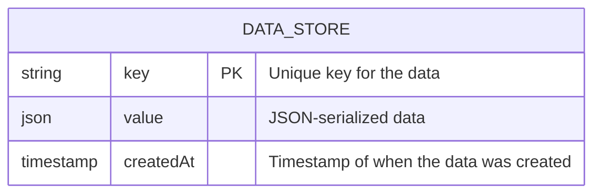
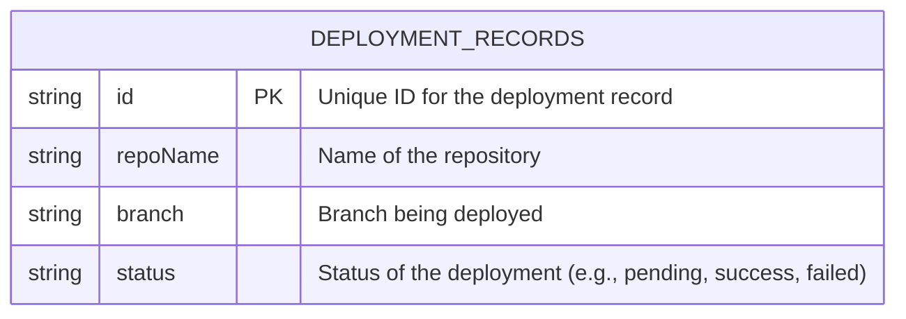

# Data Persistence Module

## Purpose
Provides file-based storage for application state, including tokens, deployment records, and other application data. It uses a simple file-based approach for persistence.

## Key Functions

### `persistAccessToken(accessToken)` / `persistRefreshToken(refreshToken)`
Stores the access and refresh tokens securely.

- **Parameters:**
    - `accessToken` (string): The OAuth 2.0 access token.
    - `refreshToken` (string): The OAuth 2.0 refresh token.

- **Example:**
```javascript
await persistAccessToken("some_access_token");
await persistRefreshToken("some_refresh_token");
```

### `getData(key)`
Retrieves data from the store based on the provided key.

- **Parameters:**
    - `key` (string): The key to identify the data.

- **Returns:**
    - `Promise<any>`: A promise that resolves with the stored data, or `null` if the key is not found.

- **Example:**
```javascript
const accessToken = await getData("accessToken");
console.log("Access Token:", accessToken);
```

### `setData(key, value)`
Sets data in the store for the given key.

- **Parameters:**
    - `key` (string): The key to store the data under.
    - `value` (any): The data to store (must be JSON serializable).

- **Example:**
```javascript
await setData("accessToken", "new_access_token");
```

### `pruneDupes(key,idKey='id')`
Removes duplicate entries from a list stored under the given key.

- **Parameters:**
    - `key` (string): The key of the list to prune.
    - `idKey` (string, optional): The key within each list item that uniquely identifies the item. Defaults to 'id'.

- **Example:**
```javascript
await pruneDupes("deployments");
```

## Data Model

### `DATA_STORE`
Represents the structure for generic key-value data storage.



### `DEPLOYMENT_RECORDS`
Represents the structure for storing deployment information.



## Operations Flow
1.  Token persistence on auth callback using `persistAccessToken` and `persistRefreshToken`.
2.  Deployment tracking updates using `setData` to store deployment records.
3.  Automated data pruning via cron using `pruneDupes` to remove duplicate deployment entries.

## Dependencies
- File system operations for reading and writing data.
- JSON serialization for storing complex data structures.
- Cron job scheduler for automated data pruning.