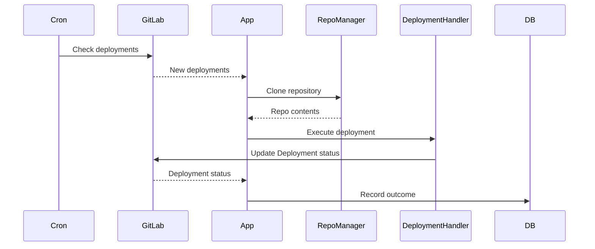
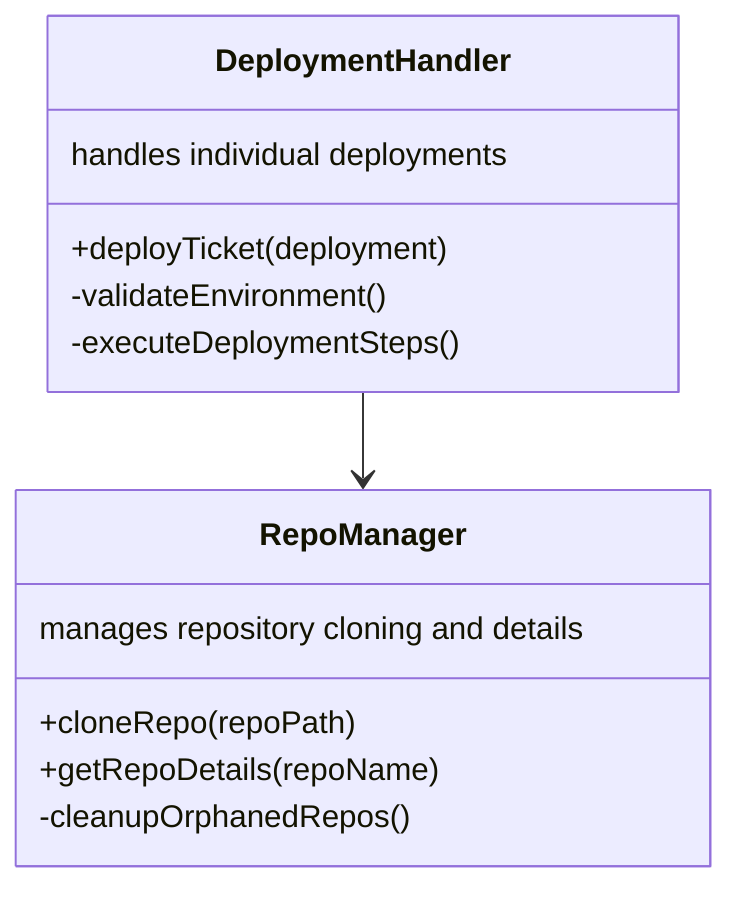

# GitLab Integration Module

## Purpose
Manages GitLab repository cloning, deployment automation, and API interactions. It orchestrates the deployment process based on GitLab events.

## Key Functions

### `cloneRepo()`
Handles the cloning of GitLab repositories, including error recovery and retry mechanisms.

- **Details:** This function is responsible for cloning the repository from GitLab to the local file system. It includes error handling to manage potential issues during the cloning process, such as network failures or invalid repository URLs.

### `processDeployments()`
Main function for orchestrating the deployment process.

- **Details:** This function is triggered by a cron job and is responsible for checking GitLab for new deployments. It retrieves deployment information from GitLab and then calls the `deployTicket()` function to handle each individual deployment.

### `deployTicket()`
Handles the deployment of a single ticket or deployment request.

- **Details:** This function takes a deployment object as input and performs the necessary steps to deploy the code. This includes validating the environment, executing deployment steps, and updating the deployment status in the database.

## Deployment Workflow

**Details:**

1.  **Cron:** A cron job periodically checks GitLab for new deployments.
2.  **GitLab:** GitLab responds with information about new deployments.
3.  **App:** The application receives the deployment information and uses the `RepoManager` to clone the repository.
4.  **RepoManager:** The `RepoManager` clones the repository and returns the repository contents to the application.
5.  **App:** The application uses the `DeploymentHandler` to execute the deployment.
6.  **DeploymentHandler:** The `DeploymentHandler` executes the deployment steps and updates the deployment status in GitLab.
7.  **GitLab:** GitLab responds with the deployment status.
8.  **App:** The application records the outcome of the deployment in the database.

## Class Relationships

**Details:**

*   **DeploymentHandler:** This class is responsible for handling individual deployments. It includes methods for validating the environment and executing the deployment steps.
*   **RepoManager:** This class is responsible for managing the cloning of repositories and retrieving repository details. It also includes a method for cleaning up orphaned repositories.

## Error Handling

*   Automatic retries on network failures during repository cloning.
*   Repository cleanup on failed clones to prevent disk space issues.
*   Deployment status tracking for auditing and monitoring purposes.

## Dependencies

*   Git CLI operations for cloning and managing repositories.
*   File system management for storing and accessing repository files.
*   Data persistence (db.js) for storing deployment records and status.
*   Helper utilities (helpers.js) for various tasks.