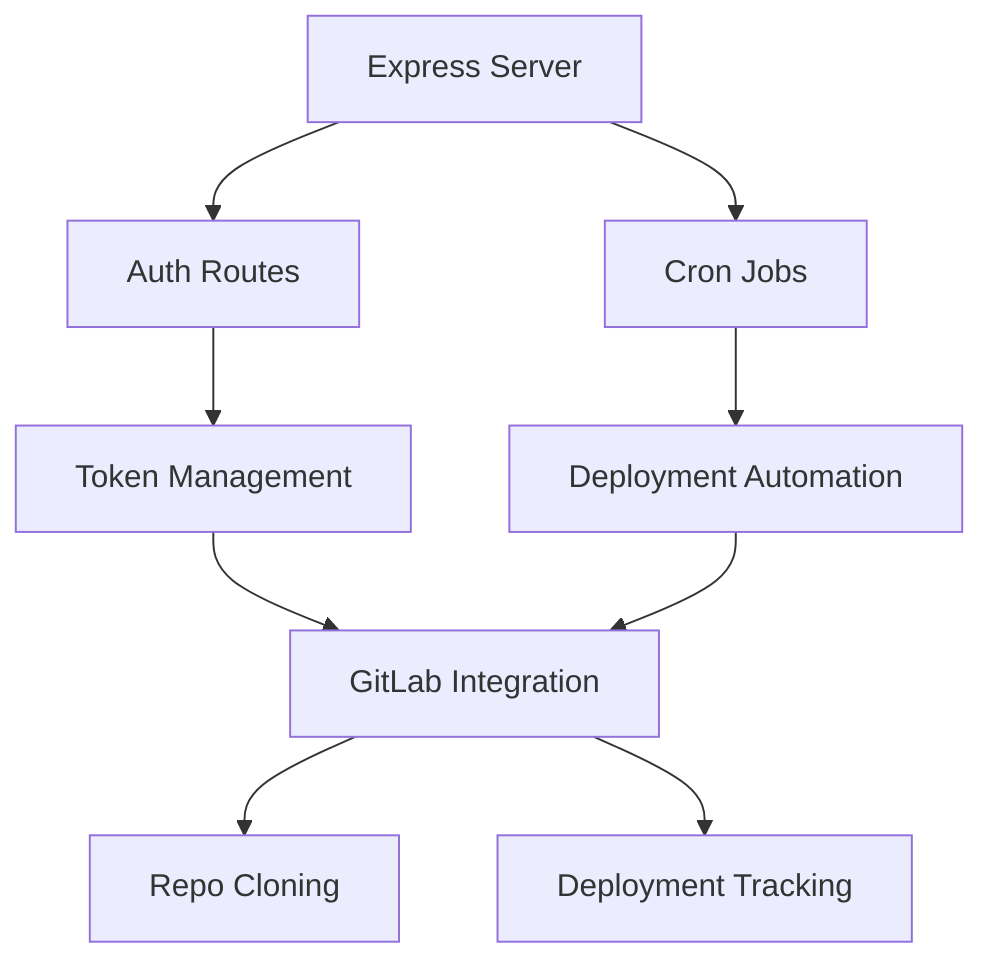

# Teams Node Deployer Overview

## System Architecture

## Tech Stack
- **Runtime**: Node.js 18+
- **Web Framework**: Express 4.x
- **Authentication**: OAuth 2.0
- **Scheduling**: Node Cron
- **Version Control**: Git CLI integration
- **Data Storage**: File-based persistence

## Key Flows
1. Server Initialization
2. Authentication Setup
3. Cron Job Configuration
4. Deployment Processing
5. Subscription Management

## Design Patterns
- Factory Pattern (Git operations)
- Dependency Injection (Route configuration)
- Singleton (Data store access)